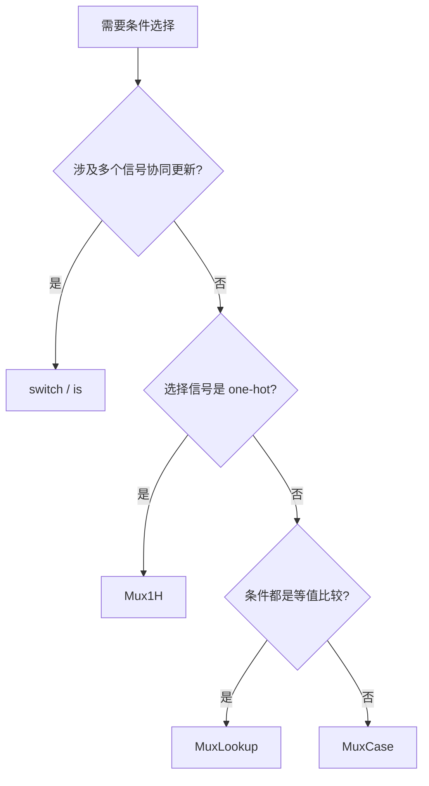

# Chisel 多路选择规范

`switch`/`is` 和 `MuxLookup`/`Mux1H`/`MuxCase` 最终生成相同的硬件（FIRRTL ExpandWhens 展开后等价），选择依据是**可读性**而非性能。核心原则：`switch`/`is` 用于**控制流**（一个条件驱动多个信号），Mux 系列用于**数据通路**（纯值选择）。

## 决策流程

## 各构造适用场景

| 构造 | 适用场景 | 示例 |
|------|----------|------|
| `switch`/`is` | 状态机、CSR 写、地址译码——一个条件驱动多个信号 | `switch(state) { is(sIdle) { pc := x; valid := y } }` |
| `MuxLookup` | 单信号、key→value 查表 | `MuxLookup(key, default)(Seq(A -> v1, B -> v2))` |
| `Mux1H` | 选择信号已是 one-hot（如 `ChiselEnum`） | `Mux1H(op.asUInt, Seq(add, sub, sll))` |
| `MuxCase` | 条件不是简单等值比较，而是任意 Bool 表达式 | `MuxCase(d, Seq((x > 3.U) -> a, (y === 0.U) -> b))` |

## 反模式

- ❌ 用 `switch` 做单信号选择：应改用 `MuxLookup`。
- ❌ 用手工级联 Mux 模拟状态机：应改用 `switch`/`is`，让每个状态的完整行为局部聚合。
- ❌ 有 one-hot 选择信号却用 `MuxLookup`：应改用 `Mux1H`（硬件更高效）。
