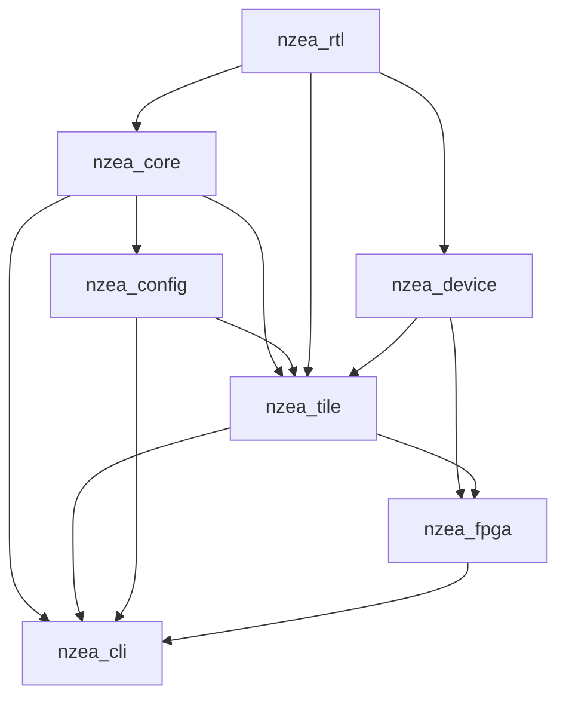
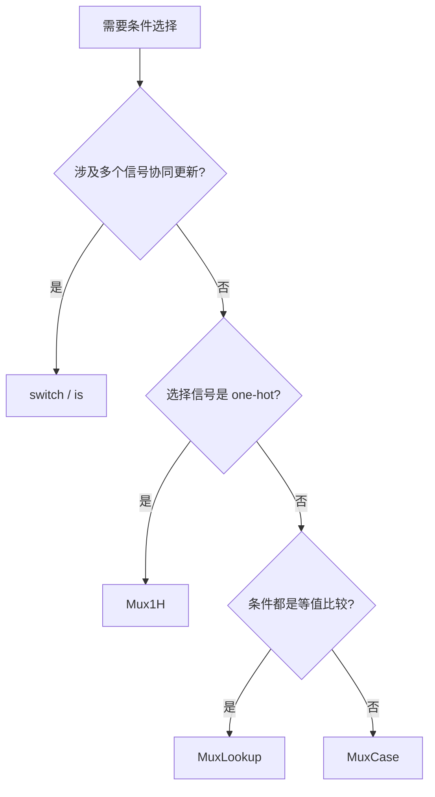

# 仓库指南

## 项目结构与模块组织
活跃的 Scala/Chisel 代码按角色划分：

| 模块 | 用途 |
|--------|---------|
| `nzea_rtl/src` | 共享 RTL 工具（FabricBus、LiteBus、crossbar、arbiter、Pipe、MuxTree） |
| `nzea_device/src` | 可复用设备 IP（UART、定时器等），不依赖任何业务模块 |
| `nzea_core/src` | 核心流水线：前端（IFU/IDU/ISU/RAT/PRF/CSR/BP）、后端（integer/V/NNU/LSU）、退休（ROB/Commit/WBU） |
| `nzea_config/src` | 共享配置模型：`NzeaConfig`（全局生成选项）和 `CoreConfig`（微架构/ISA） |
| `nzea_tile/src` | Tile 级 SoC 封装（NzeaTile + FabricBus crossbar + 平台设备） |
| `nzea_fpga/src` | FPGA 板级包装：板级顶层、引脚约束、综合后处理 |
| `nzea_cli/src` | CLI 入口；解析参数并分发到 `CoreElaborate`、`TileElaborate` 或 `FpgaElaborate` |
| `wave_tracker/` | 独立的 Rust CLI，用于 FST/VCD 波形分析和 RTL 级调试 |

### 依赖方向

`nzea_cli` 依赖 `nzea_core`、`nzea_tile`、`nzea_config`、`nzea_fpga` 用于参数解析和目标分发。
`nzea_config` 仅依赖 `nzea_core` 中的 `CoreConfig`。

### 设计原则
1. 配置集中在 `nzea_config` 中，避免重复的 CLI 解析逻辑。
2. 保持作用域明确：将 `config.core` 传入 core/tile 硬件模块；将非核心流程选项保留在顶层 `NzeaConfig` 中。
3. 将 CLI 关注点与硬件生成分离，使生成过程能被测试和工具复用。
4. 优先使用职责明确的小模块，而非多功能大文件。
5. 版本常量（`scalaV`、`chiselV` 等）在 `build.mill` 中统一定义，各模块复用。

## 工作基线
在构建或验证工作前，先执行 `nix develop`。该 flake 锁定了 `mill`、`scalafmt`、`yosys`、`ieda`、JDK 和 Rust nightly，并导出 `PDK_PATH` 用于综合和 STA 流程。

## 构建、测试和开发命令
优先使用仓库的 `justfile` 而非临时命令。常用命令：

- `just init`：为编辑器安装 BSP 元数据。
- `just dump <args>`：将 RTL 生成到 `build/<target>/<platform>/<isa>/<sim|sta>/`。
- `just dump-tile <args>`：`just dump --target tile <args>` 的便捷别名。
- `just synth <args>`：生成综合就绪的 RTL，然后运行综合。
- `just sta <args>`：运行综合加 STA；需要 Nix shell 提供的 `PDK_PATH`。
- `just clean-all`：清理 `build/` 和 Mill 缓存。

### 快速编译检查
- `mill nzea_core.compile` 或 `mill nzea_tile.compile`：编译单个 Scala 模块。

### 运行测试
- `just test <module>`：运行模块中的所有测试（默认 `nzea_rtl`；也支持 `nzea_core`）。
- `just test-suites <module> <suites...>`：运行指定的 ScalaTest 套件，例如 `just test-suites nzea_rtl FabricBusCrossbarTest FabricBusAdapterTest`。
- `just test-match <module> <pattern>`：运行文件名匹配 `*Test.scala` 正则的套件，例如 `just test-match nzea_core "Vector.*Test"`。
- `just tb <pattern>`：`just test-match nzea_rtl <pattern>` 的便捷别名。
- `mill nzea_core.test` 或 `mill nzea_rtl.test`：直接通过 Mill 运行所有测试。

### Wave Tracker
- `cd wave_tracker && cargo run --release -- --help`：查看波形工具选项。
- `cd wave_tracker && cargo test`：运行 Rust 测试。
- `cd wave_tracker && cargo clippy`：运行 Rust lint。
- `cd wave_tracker && cargo fmt --check`：检查 Rust 格式。

### 四态仿真（iverilog）
- `just iv platform=<platform> isa=<isa>`：生成 RTL、编译并运行四态仿真。
  - 示例：`just iv platform=hellofpga isa=riscv32i`
  - 输出：`build/tile/<platform>/<isa>/hw/iverilog/tb.{vvp,fst}`
- `just iv-build platform=<platform> isa=<isa>`：仅编译。
- `just iv-run platform=<platform> isa=<isa>`：运行已编译的仿真。

测试平台源码位于 `nzea_tile/sim/`（总线模型、测试程序）。使用 `--sim false` 生成的 RTL，因为它暴露总线 IO 而不带 DPI 桥接，测试平台中的行为总线模型通过 `$readmemh` 加载的纯 Verilog  内存模型替代 DPI。

## 编码风格与命名规范
遵循文件现有的风格，不要重新格式化无关代码。Scala 中类、对象、模块使用 `PascalCase`，val 和方法使用 `camelCase`，测试文件以 `*Test.scala` 结尾。Rust 遵循标准惯例：模块和函数用 `snake_case`，类型用 `CamelCase`。注释和文档字符串仅使用英文。优先使用小模块，注释应解释意图或风险，而非逐行描述机制。

### 格式化
- Scala：使用 `scalafmt`（通过仓库根目录的 `.scalafmt.conf` 配置）。
- Rust：使用 `cargo fmt` 和 `cargo clippy`。

## 仓库特定规则
- 不要将 JAR 或归档文件解压到仓库目录中。使用只读检查，如 `jar tf`，或解压到 `/tmp`。
- 注释和文档字符串仅使用英文。
- 不要重新引入已删除的命令，如 `just run`。
- 修改综合或 STA 脚本时，保持命令示例与当前 `justfile` 一致。

### 解码与 Chisel 注意事项
- `DecodeTable.decode(inst)` 可能会记录 Espresso 失败并回退到 QMC；这是预期行为，除非你安装了 Espresso。生成的 RTL 是有效的。
- 如果出现将非字面量 `UInt` 转换为 `ChiselEnum` 的解码警告，将解码字段定义为 `UInt(enum.getWidth.W)`，并在使用处通过 `EnumType.safe(...)` 进行转换。

### Chisel 多路选择规范
`switch`/`is` 和 `MuxLookup`/`Mux1H`/`MuxCase` 最终生成相同的硬件（FIRRTL ExpandWhens 展开后等价），选择依据是**可读性**而非性能。核心原则：`switch`/`is` 用于**控制流**（一个条件驱动多个信号），Mux 系列用于**数据通路**（纯值选择）。

**决策流程：**

**各构造适用场景：**

| 构造 | 适用场景 | 示例 |
|------|----------|------|
| `switch`/`is` | 状态机、CSR 写、地址译码——一个条件驱动多个信号 | `switch(state) { is(sIdle) { pc := x; valid := y } }` |
| `MuxLookup` | 单信号、key→value 查表 | `MuxLookup(key, default)(Seq(A -> v1, B -> v2))` |
| `Mux1H` | 选择信号已是 one-hot（如 `ChiselEnum`） | `Mux1H(op.asUInt, Seq(add, sub, sll))` |
| `MuxCase` | 条件不是简单等值比较，而是任意 Bool 表达式 | `MuxCase(d, Seq((x > 3.U) -> a, (y === 0.U) -> b))` |

**反模式：**
- ❌ 用 `switch` 做单信号选择：应改用 `MuxLookup`。
- ❌ 用手工级联 Mux 模拟状态机：应改用 `switch`/`is`，让每个状态的完整行为局部聚合。
- ❌ 有 one-hot 选择信号却用 `MuxLookup`：应改用 `Mux1H`（硬件更高效）。

## 测试指南
- Scala 回归测试位于 `nzea_core/test/src` 和 `nzea_rtl/test/src`。
- 测试名称应具有描述性，例如 `VectorBackendTest.scala` 或 `DbusMemBridgeTest.scala`。
- 对于 `wave_tracker`，在受影响的 Rust 模块附近添加聚焦的单元测试，并运行 `cargo test`。
- 修改综合或 STA 流程时，应附上使用的具体命令和生成的报告路径。

## 提交与 Pull Request 指南
近期历史使用简短的 conventional 主题格式，如 `feat: nnu`、`fix: DIV pre path` 和 `chore: rtl split`。优先使用 `类型: 简洁摘要` 的祈使语句格式。PR 应说明受影响的范围，列出验证命令，链接相关问题，当修改影响生成的 RTL、时序或调试工具输出时，应附上报告片段或截图。

## iverilog 仿真调试

### 超时 vs 死锁
在诊断失败的仿真时，始终从较短的超时（10 秒）开始，然后翻倍。**如果增加超时后提交计数始终停留在相同数字，说明仿真已死锁，而非运行缓慢。** 不要继续增加超时——应调查最后几条提交。

### 数据损坏检查清单
本项目中的死锁仿真可归为几类。按以下顺序检查：

1. **提交跟踪中出现 X**——`rd=xN val=0xXXXX` 或 `next_pc=0xXXXX` 表示读取了未初始化的内存。最常见原因：
   - Hex 文件加载时被截断（检查 `boot_from_hex` / `$readmemh` 中的哨兵值）
   - BSS 段未清零（检查 `_start` 代码）
   - 栈/堆溢出超出 RAM 末尾（检查 `x2` 的值与 `AddressMap.ram` 范围的比较）

2. **卡在同一 PC**——死循环。检查该 PC 处的汇编代码。常见模式：
   - LSR 轮询：`lbu aN, offset(t0); andi; beqz loop`——驱动程序与硬件寄存器映射之间的 `offset` 不匹配
   - 自跳转：`j .`——加载了错误的指令，或者指令正确但预期应该跳出循环

3. **完全没有提交**——CPU 从未启动。检查：
   - `cpu_running` 信号监控的是实际核心复位，而非 BootFsm 输出（直接启动模式下 BootFsm 可能被绕过）
   - `boot_override` 是否针对启动模式正确设置

### Verilog 中的哨兵值
切勿使用 `0x00000000` 作为 hex 加载的哨兵值——它是一个有效的 RISC-V 指令。使用 `0xDEADBEEF` 或其他不会出现在编译程序中的值。

### 修改现有系统
在向现有集成添加参数或特性时（例如，将 `boot` 从 am-zig 的 `just run` 传递到 nzea 的 `just iv`），任务就是：**在调用链中添加一个参数**。不要：
- 修改无关代码（hex 路径生成、nushell 语法、direnv 标志）
- 重写运行器或构建系统
- 修复已有的问题，除非它们阻碍参数正常工作

如果一个简单的参数添加需要超过 3 处编辑，停下来重新阅读现有代码的实际逻辑。该参数很可能只需要追加到现有的命令行中。

## Agent 使用规范
Agent 在调用 `just` recipe 或其他依赖 Nix flake 环境的命令（`mill`、`yosys`、`nextpnr-*`、`nu` 等）时，必须通过 `nix develop --command bash -c '...'` 启动，因为 Agent 默认不在 nix shell 中。用户在自己终端中已事先进入 nix shell，不受此限制。

修改 Scala/Chisel 代码后，Agent 必须运行 `nix develop --command bash -c 'just dump --target tile --platform hellofpga --isa riscv32im --sim false'` 验证编译和 Chisel 生成均通过再报告完成。
