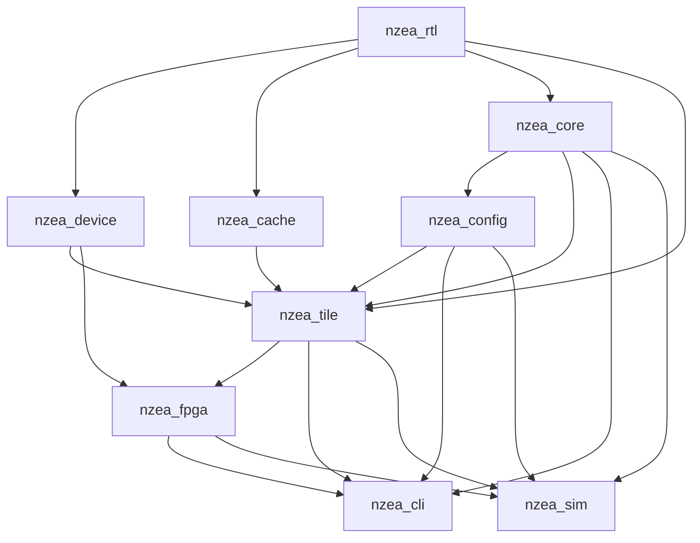

# 仓库指南

## 项目结构与模块组织

| 模块 | 用途 |
|--------|---------|
| `nzea_rtl/src` | 共享 RTL 工具（FabricBus、LiteBus、crossbar、arbiter、Pipe、MuxTree） |
| `nzea_device/src` | 可复用设备 IP（UART、定时器等），不依赖任何业务模块 |
| `nzea_cache/src` | Cache 实现（I-Cache、D-Cache），依赖 `nzea_rtl` |
| `nzea_core/src` | 核心流水线：前端（IFU/IDU/ISU/RAT/PRF/CSR/BP）、后端（integer/V/NNU/LSU）、退休（ROB/Commit/WBU） |
| `nzea_config/src` | 配置模型叶子模块（零依赖）：`core/`（CoreConfig、BpuConfig、IsaConfig、FuConfig、PayloadSpec、CacheConfig 等）、`tile/`（TileConfig）、`fpga/`（FpgaConfig）、顶层构建流程枚举（SynthPlatform 等） |
| `nzea_tile/src` | Tile 级 SoC 封装（NzeaTile + FabricBus crossbar + 平台设备） |
| `nzea_fpga/src` | FPGA 板级包装：板级顶层、引脚约束、综合后处理 |
| `nzea_cli/src` | CLI 入口；解析参数并分发到 `CoreElaborate`、`TileElaborate` 或 `FpgaElaborate` |
| `nzea_sim/src` | 仿真层模块，为 tile/fpga 生成独立仿真 RTL + TB，输出到 `build/sim/` |
| `pulse/` | 波形分析 CLI（info/scope/signal/value/property + 事件文件跨模块组合），替代 wavepeek；用法见 `.agents/skills/pulse/` |
| `wave_tracker/` | 独立的 Rust CLI，用于 FST/VCD 波形分析和 RTL 级调试 |

### 依赖方向

`nzea_cli` 依赖 `nzea_core`、`nzea_tile`、`nzea_config`、`nzea_fpga` 用于参数解析和目标分发。
`nzea_config` 是零依赖叶子：所有硬件模块（core/tile/fpga/cli/sim）依赖它，配置定义与修改集中在单一模块。

### 设计原则
1. 配置集中在 `nzea_config` 中，避免重复的 CLI 解析逻辑。
2. 保持作用域明确：`CoreConfig` 通过 implicit 通道传入硬件模块（`NzeaTile`/`Core`）；非核心流程选项（平台、时钟等）保留在 `TileConfig`/`FpgaConfig` 中。
3. 将 CLI 关注点与硬件生成分离，使生成过程能被测试和工具复用。
4. 优先使用职责明确的小模块，而非多功能大文件。
5. 版本常量（`scalaV`、`chiselV` 等）在 `build.mill` 中统一定义，各模块复用。
6. **禁止关键参数有默认值**。跨模块传递的配置参数（`clockHz`、`cache`、`sim` 等）不得有 Scala 默认值；编译器必须强制每个调用点显式传参。`case class` 的默认值仅允许用于 CLI 入口层（`CliArgs`），且必须与所有下游签名保持一致（一处修改，全链路报错）。

## 工作基线
构建或验证前先执行 `nix develop`。该 flake 锁定 `mill`、`scalafmt`、`yosys`、`ieda`、JDK 和 Rust nightly，并导出 `PDK_PATH`。

项目提供 `flake.nix` 作为推荐开发环境，但 **recipe 和脚本中不得内嵌 `nix develop` 调用**。协作者应该能用自己的包管理器配置好环境后正常使用 `just` 和所有脚本。

## 构建、测试和开发命令
优先使用 `justfile` 而非临时命令。

- `just init`：安装 BSP 元数据。
- `just dump <args>`：生成 RTL 到 `build/<target>/<platform>/<isa>/<sim|sta>/`。
- `just synth <args>`：生成综合就绪 RTL 并运行综合。
- `just sta <args>`：综合 + STA；需要 `PDK_PATH`。
- `just clean-all`：清理 `build/` 和 Mill 缓存。
- `mill nzea_core.compile` / `mill nzea_tile.compile`：快速编译检查。

### 运行测试
- `just test <module>`：运行模块全部测试（默认 `nzea_rtl`）。
- `just test-match <module> <pattern>`：类名匹配 pattern 的套件，支持通配符或精确类名。
- `mill nzea_core.test` / `mill nzea_rtl.test`：直接通过 Mill 运行。

测试源码位于 `nzea_core/test/src`、`nzea_rtl/test/src` 和 `nzea_cache/test/src`，命名应具有描述性（如 `VectorBackendTest.scala`）。修改综合或 STA 流程后附上具体命令和报告路径。

### Wave Tracker
- `cd wave_tracker && cargo run --release -- --help`
- `cd wave_tracker && cargo test` / `cargo clippy` / `cargo fmt --check`

### 仿真（iverilog）
- `just iv tile yosys <isa> [hex] [boot] [wave]`：tile 四态仿真（**仅 yosys 平台**——fpga 平台设备在板外/平台 IP，TB 未覆盖）。
- 输出：`build/sim/tile/yosys/<isa>/hw/iverilog/tb.{vvp,fst}`
- 测试平台位于 `nzea_sim/sim/`。iv 使用 `sim=false` 的可综合 RTL 作为仿真对象；yosys 平台的板外设备（RAM/UART/CLINT/finisher）以真实 RTL 替身（`yosys.DeviceModels`）挂接，hex 通过 `$readmemh` 直接初始化 RAM。

**Chisel TB 规范**：必须有 `io.result` 锚定输出 + `dontTouch` 关键信号防 DCE；companion object 提供 `emitWrapper(outDir)` 写 `initial`/`timescale` wrapper；`BlackBoxInline` 不能做顶层；tile TB 保持 Verilog（CIRCT 提取的 RAM 模块层次由 TB 直接引用，Chisel TB 无法稳定锚定）。

调试死锁仿真 → 加载 skill `iverilog-debug`。

## 编码风格与命名规范
遵循文件现有风格，不要重新格式化无关代码。Scala：类/对象/模块 `PascalCase`，val/方法 `camelCase`。Rust：`snake_case` 函数，`CamelCase` 类型。注释和文档仅英文。优先小模块，注释解释意图或风险。

**格式化**：Scala 用 `scalafmt`（`.scalafmt.conf`），Rust 用 `cargo fmt` + `cargo clippy`。

## 仓库特定规则
- 不要解压 JAR/归档到仓库目录；用 `jar tf` 或解压到 `/tmp`。
- 注释和文档仅英文。
- 禁止重新引入已删除的命令（如 `just run`）。
- 修改综合或 STA 脚本时，保持命令示例与 `justfile` 一致。
- **事件文件按需添加**：`.pulse` 事件文件遵循“用到再说”原则——调试到某个具体问题、确认事件确实被查询需要时，才为对应模块添加并留在该模块目录（`nzea_cache/cache.pulse`、`nzea_core/core.pulse` 即此原则的历史产物，可作示例模板）。禁止提前为未调试模块批量创建事件文件。

### 解码与 Chisel 注意事项
- `DecodeTable.decode(inst)` 的 Espresso 失败回退 QMC 是预期行为，生成 RTL 有效。
- 非字面量 `UInt` → `ChiselEnum` 警告：将字段定义为 `UInt(enum.getWidth.W)`，使用 `EnumType.safe(...)` 转换。
- Chisel 多路选择规范 → 加载 skill `chisel-mux-select`。

## 提交与 Pull Request 指南
优先 `类型: 简洁摘要`（如 `feat: nnu`、`fix: DIV pre path`）。PR 应说明受影响范围、列出验证命令、链接相关问题。修改影响 RTL/时序/调试输出时附报告片段或截图。

### Agent 行为红线（不可违反）

**0. 禁止未经明确允许修改代码。** 任何对源文件的修改（编辑、删除、sed、git 操作）必须在用户明确指令下执行。"推断用户意图"不是授权。当用户说"回滚 difftest 修改"时，你必须先列出所有受影响的文件及其分类，等待确认，不得自行判断哪些该回滚。

**1. 禁止跨仓库推断一致性。** nzea 和 remu 是独立仓库，各自有各自的修改历史和约定。在一个仓库发现签名不匹配时，不得自行修改另一个仓库来"修复一致性"。必须先报告，等待指令。

### Git 操作禁令

**Agent 禁止执行任何 git 写操作。** 包括但不限于：`commit`、`stash`、`reset`、`checkout`、`cherry-pick`、`revert`、`branch`、`merge`、`rebase`、`push`、`pull`。所有写操作由用户亲自执行。

读取操作（`log`、`status`、`diff`、`show`、`blame`）属于信息收集，允许执行，但须始终附加 `--no-pager` 避免阻塞。

### Agent 使用规范
- 调用 `just`/`mill`/`yosys`/`nextpnr-*`/`nu` 等依赖 Nix 的命令时，必须通过 `nix develop --command bash -c '...'` 启动。用户在自己终端不受此限制。
- 修改 Scala/Chisel 代码后，必须运行 `nix develop --command bash -c 'just dump --target tile --platform fpga --isa riscv32im --sim false'` 验证编译和生成通过。
- Mill 命令始终添加 `--no-server`。
- 大输出命令（`just dump`、`mill *.run`）设置 `timeout_ms`（推荐 300000 ms）。
- 构建验证一次通过即足够，不要重复运行"确认"。
- 向现有系统添加参数时，只需在调用链中追加参数；超过 3 处编辑说明方向错了。不要修改无关代码或重写运行器。

### 调试宪法（FPGA/硬件调试规则）
1. **硬件迭代上限**：同一问题硬件测试失败 ≥ 3 次后，**禁止继续硬件迭代**，必须切换到仿真定位。
2. **仿真模型必须官方**：禁止手写 IP 行为模型（如 MIG、MMCM、PLL）。必须使用 Vivado 生成的官方仿真文件。
3. **信号语义必须查文档**：任何 IP 接口信号（mask、极性、对齐方式）不得通过实验反推。优先查 UG/PG 文档，其次查 IP example design 的 RTL 源码。
4. **仿真先行**：修改与外部 IP 交互的逻辑时，先在仿真中验证通过，再上板测试。不长于 5 分钟能跑完的仿真优先于一次 30 分钟的 bitstream 生成。
